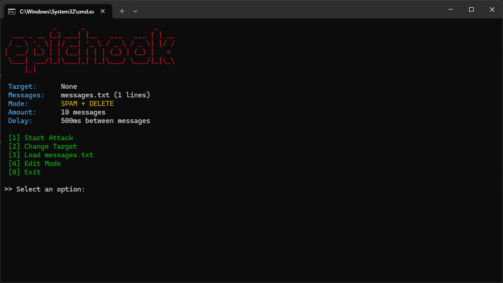

# epichook

**epichook** is a simple CLI tool to spam and delete discord webhooks.

## 📸 Screenshot



## 🛠️ Usage

```bash
git clone https://github.com/yourname/epichook.git
cd epichook
java -jar epichook.jar
```
